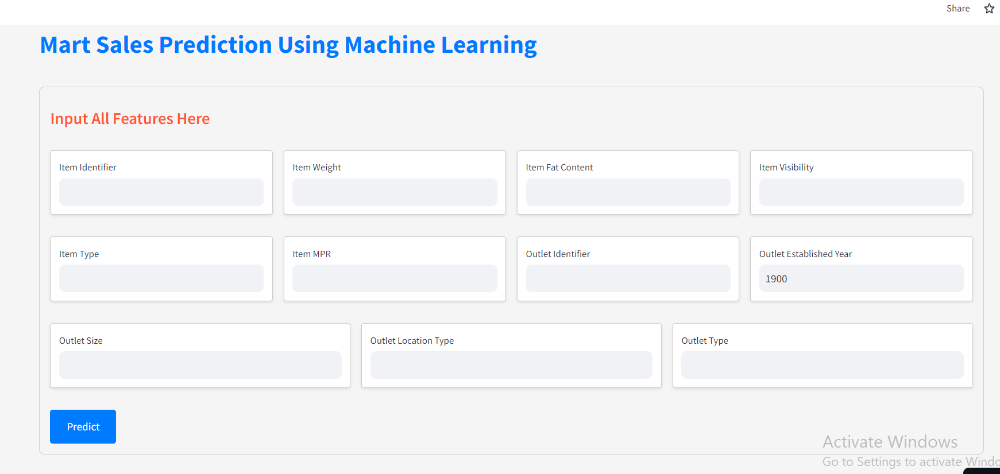

# Mart Sales Prediction Using Machine Learning



## Overview
This project implements XGBoost regression to predict sales in retail stores using the Big Mart Sales Challenge dataset. It aims to provide insights into factors influencing sales, such as item type, visibility, and store location.

## Features
- Predict sales based on various input parameters.
- User-friendly interface deployed on Streamlit Cloud.
- Integration with XGBoost regression model for accurate predictions.

## Key Technologies Used
- Python
- XGBoost
- Streamlit
- Git & GitHub

## Installation
1. Clone the repository:
   ```bash
   git clone https://github.com/ibad321/Mart-Sales-Prediction-Using-Machine-learning.git
2. Navigate into the project directory:
    ```bash
    cd Mart-Sales-Prediction-Using-Machine-learning
3. Install dependencies:
     ```bash
   pip install -r requirements.txt
     
## Usage
 Run the Streamlit app:
 ```bash
streamlit run app.py


Open your browser and go to http://localhost:8501 to view the application.


     

   

   
   
